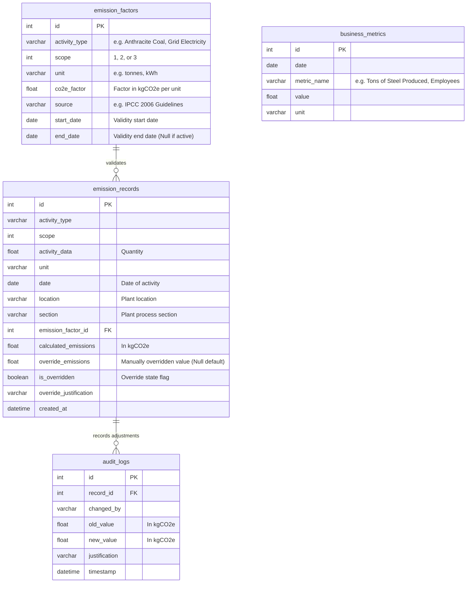

# Exascale Carbon Emissions Reporting Platform (GHG Prototype)

This repository contains a containerized prototype of an end-to-end Greenhouse Gas (GHG) Emissions Reporting Platform. The system supports tracking and visual reporting of **Scope 1 (Direct)**, **Scope 2 (Indirect)**, and **Scope 3 (Value Chain)** emissions in accordance with the international GHG Protocol standard.

---
# Deployed Link : https://exacarbon-platform.onrender.com/

## 🏗️ Architecture & Technology Stack

The platform is designed with a clean, decoupled client-server architecture:

- **Frontend**: Single-Page Application (SPA) built using semantic HTML5, modern vanilla JavaScript (ES6+), custom CSS3 (premium dark-mode styling, glassmorphism, responsive grid, micro-animations), and **Chart.js** for high-fidelity interactive data visualizations.
- **Backend**: **FastAPI** (Python) providing high-performance, asynchronous REST API endpoints with robust automatic validation via **Pydantic** schemas.
- **Database**: Relational **SQLite** database (`emissions.db`), self-contained inside the backend workspace. It enables local persistence without requiring external server dependencies.
- **ORM & Driver**: **SQLAlchemy 2.0** for object-relational mapping, transactions, and date queries.

---

## 🗄️ Database Schema & Data Models

Our schema supports temporal factor versioning, business operational metrics, and complete manual audit overrides:



### Advanced Reporting Logic
- **Historical Accuracy**: The calculations engine ensures that when an emission record is submitted, it searches for a versioned emission factor in `emission_factors` matching the activity date (`start_date <= record.date <= end_date`). Expired or future factors do not skew calculations.
- **Intensity Metrics**: Ratios are dynamically calculated as `kgCO2e / Ton of Steel Produced` or `kgCO2e / Employee` based on the corresponding monthly or annual database metrics.
- **Override Audit Trail**: Manual corrections do not wipe out history. Overrides update the `override_emissions` value and trigger an automatic insert in `audit_logs` preserving the previous calculated value, author, and justification.

---

## 🚀 Getting Started

### Prerequisites
- Python 3.11+
- pip (Python Package Installer)
- Docker (Optional)

### Option A: Local Deployment (No Docker)

1. **Clone & Navigate** into the workspace directory:
   ```bash
   cd Exascale-Assignment-2
   ```

2. **Install Dependencies**:
   ```bash
   pip install -r backend/requirements.txt
   ```

3. **Initialize and Seed Database**:
   Runs the seeder to read `GHG Sheet .xlsx`, import factors and records, synthesize 2023 & 2025 YoY datasets, and populate business metrics:
   ```bash
   python -m backend.app.seeder
   ```

4. **Start Web Server**:
   ```bash
   uvicorn backend.app.main:app --host 0.0.0.0 --port 8000 --reload
   ```

5. **Access the App**:
   Open [http://localhost:8000](http://localhost:8000) in your web browser.

---

### Option B: Docker Containerized Deployment

1. **Build Container Image**:
   ```bash
   docker build -t exacarbon-platform .
   ```

2. **Run Container**:
   Runs seeder and launches server on port 8000:
   ```bash
   docker run -d -p 8000:8000 --name exacarbon exacarbon-platform
   ```

3. **Docker Compose Launch** (Alternative):
   ```bash
   docker-compose up -d --build
   ```

4. **Access the App**:
   Open [http://localhost:8000](http://localhost:8000) in your web browser.

---

## 🧪 Running Tests & Verification

We have implemented an integration test suite validating:
- **Historical accuracy** of date-scoped factor lookups (2023 vs 2024 vs 2025).
- **Overrides** logic and corresponding audit trail updates.
- **Analytics calculations** (YoY, hotspots, and production intensity).

Run the tests locally:
```bash
python verify.py
```

---

## 📡 API Reference Endpoints

| Method | Endpoint | Description |
| :--- | :--- | :--- |
| `GET` | `/api/emission-factors` | Retrieve list of versioned factors |
| `POST` | `/api/emission-records` | Submit activity, lookup valid factor, and compute emissions |
| `GET` | `/api/emission-records` | Fetch emissions history (filterable by Scope/Location) |
| `PUT` | `/api/emission-records/{id}/override` | Perform a manual override and append to Audit Log |
| `GET` | `/api/audit-logs` | Retrieve chronological override history |
| `POST` | `/api/business-metrics` | Log a business metric (Steel tons, Employees) |
| `GET` | `/api/analytics/yoy` | Scope 1 & 2 sums compared current vs. previous year |
| `GET` | `/api/analytics/intensity` | kgCO2e emissions per business metric unit |
| `GET` | `/api/analytics/hotspot` | Breakdown of emissions by source percentage |
| `GET` | `/api/analytics/monthly-trend` | Monthly aggregated totals for the charts |
